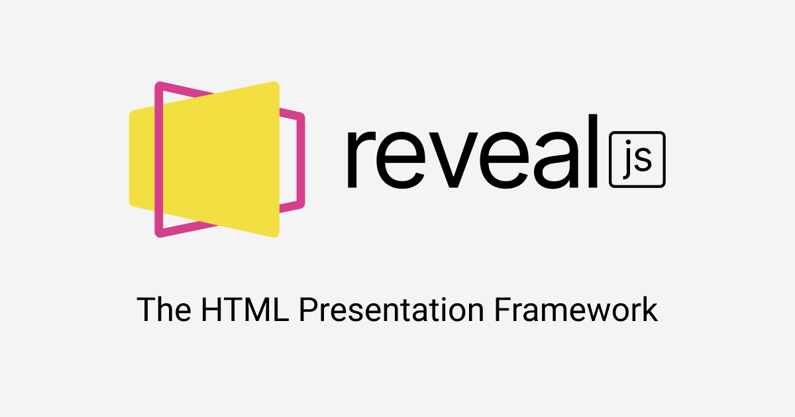

## About

Make great slides for conf and labs

# Tools

- RevealJS
- Pandoc

## Pandoc


## Revealjs



# Tips

## Show some code

Code `Javscript`

```javascript
//------ lib.js ------
export const sqrt = Math.sqrt;
export function square(x) {
  return x * x;
}
export function diag(x, y) {
  return sqrt(square(x) + square(y));
}

//------ main.js ------
import { square, diag } from "lib";
```

## Split slides

---

Part 1

---

Part 2

---

Part 3

---

## Layout

---

bullet list:

* list
* list
* list
  
---

Num list :

1. list
2. list
3. list

---

Checkbox:

- [ ] list
- [ ] list
- [ ] list

---

Quotes:

> My quote !
> > My quote !


## Title 2

### Title 3

#### Title 4


# Thanks !
